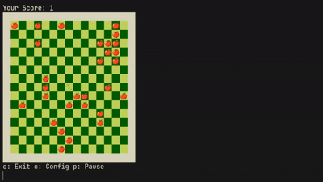

# 🐍 High-Performance Snake in Go

[](https://go.dev/)
[](LICENSE)
[](https://github.com/XPLassal/simple-snake-on-go/releases)

A modern, hyper-optimized implementation of the classic Snake game that runs directly in your terminal. Written in **Pure Go** with a focus on **Clean Architecture** and **O(1) Algorithms**.



---

## ⚡ Key Features (v3.1)

* **⏸️ Pause Game:** Need a break? Press **'P'** to freeze the snake. Press any direction key to resume.
* **⚙️ Persistent Configuration:** The game saves your settings (`config.json`). No need to enter them every time!
* **📺 ASCII Support (SSH Friendly):** Added a toggle for **Emoji** vs **ASCII** graphics. Use ASCII mode if you are running the game over SSH or on a terminal without Unicode support.
* **🚀 True O(1) Performance:** The engine uses a **Linked List via Map** structure. Movement is instant (~300ns) regardless of snake length.
* **🎮 Smart Input:** Input Locking prevents accidental "suicide turns".
* **💻 Cross-Platform:** Runs natively on **Windows**, **Linux**, and **macOS**.

---

## 🎮 How to Play

### Option 1: Download Binary (Recommended)
Download the executable for your OS from the [**Releases Page**](https://github.com/XPLassal/simple-snake-on-go/releases/latest).

| OS | File |
| :--- | :--- |
| 🪟 **Windows** | `snake-windows-amd64.exe` |
| 🐧 **Linux** | `snake-linux-amd64` |
| 🍎 **macOS (Apple Silicon)** | `snake-macos-arm64` |
| 🍎 **macOS (Intel)** | `snake-macos-intel` |

*(Linux/macOS users: run `chmod +x <file>` to make it executable).*

### Option 2: Build from Source
```bash
git clone [https://github.com/XPLassal/simple-snake-on-go.git](https://github.com/XPLassal/simple-snake-on-go.git)
cd simple-snake-on-go
go run .
```

-----

## ⚙️ Configuration

On the first run, the game will ask for your preferences. These are saved to `config.json`.

| Setting | Description |
| :--- | :--- |
| **Columns** | Map size (e.g., 20). |
| **Hard Mode** | If `y`, the game speeds up as your score increases. |
| **Use Emojis** | `y` for beautiful graphics (🐍/🍎). `n` for ASCII (`%`/`@`) - recommended for SSH/Old Terminals. |

> **Tip:** You can delete `config.json` to reset settings.

-----

## 🕹 Controls

| Key | Action |
| :---: | :--- |
| **W, A, S, D** | Move Snake ⬆️⬅️⬇️➡️ |
| **P** | **Pause Game** ⏸️ |
| **C** | **Config / Restart** (Stops current game) |
| **Q** | Quit Game |

-----

## 🏗 Technical Details

  * **Logic:** `map[Coordinates]Coordinates` (Linked List) for **O(1)** movement.
  * **Rendering:** `strings.Builder` + `bufio.Writer` for zero-allocation rendering per frame.
  * **Architecture:**
      * `main`: Game Loop & Input Handling.
      * `structs`: Domain Entities (Snake, Apple) & Persistence Logic.
      * `render`: UI & Drawing Logic.

-----

## 📄 License

This project is licensed under the MIT License.
